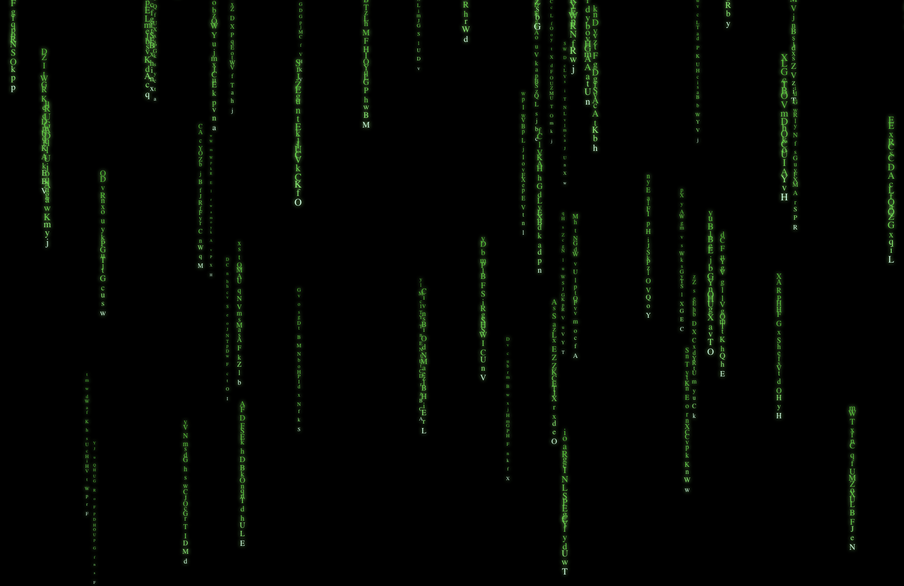

# react-matrix-code-rain

A simulation of the Matrix \"Code Rain\" effect.

[Code inspirate by](https://codepen.io/syropian/pen/nJjZaE)

## Installation

```sh
npm i react-matrix-code-rain
```

## React

### Declaration

```typescript
/// <reference types="react" />
export type MatrixCodeRainComponentProps = {
  width?: number | string;
  height?: number | string;
  timeout?: number;
  textStrip?: string[];
  theColors?: string[];
  stripCount?: number;
};
declare const MatrixCodeRainComponent: React.FC<MatrixCodeRainComponentProps>;
export default MatrixCodeRainComponent;
```

### Usages

```typescript
import './App.css';
import MatrixCodeRainComponent from 'react-matrix-code-rain';

function App() {
  return (
    <div className="App">
      <MatrixCodeRainComponent />
    </div>
  );
}

export default App;
```

### Screen


